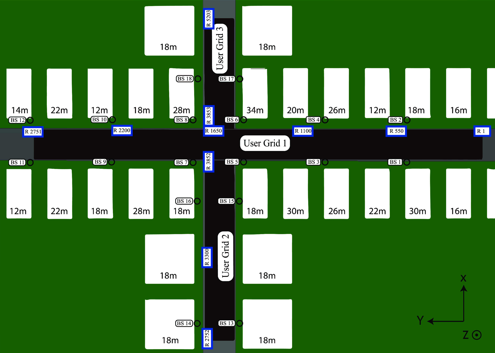

This repo contains the source codes for reproducing the results in the following paper

Huang-Chou Lin and Kuang-Hao (Stanley) Liu, "Low Overhead beam alignment for mobile millimeter channel based on continuous-time prediction" http://arxiv.org/abs/2311.01752

Please direct any questions to irat@ee.nthu.edu.tw. We will be happy to discuss and provide more details.

# Generate training data
Here are the steps for generating training data. The required files can be found in the folder "data".
   1. Download DeepMIMO and the data files of Raytracing scenario O1 in 28 GHz operating frequency from the DeepMIMO website : https://www.deepmimo.net/
   2. Set the simulation in *parameters.m*.
   3. Generate the millimeter wave channel using *DeepMIMO_Dataset_Generator.m*.
   4. Generate User trajectory at the normalized prediction instant $\tau$ with four settings.
      - *generator_ODE_beam_tracking_v2.m*: $\tau$ is randomly distributed within each prediction period. This is used to train the model.
      - *generator_ODE_beam_tracking.m*: $\tau = 0.1, 0.2, \cdots, 0.9$. This is used for model validation.
      - *generator_ODE_beam_tracking_R1.m*: $\tau = 0.01, 0.02, ..., 0.99$. This is used for model testing.
      - *generator_ODE_beam_tracking_final.m*: $\tau = 0.01, 0.02, ..., 0.99$ for each trajectory lasting for 4 seconds. A longer duration is used to examine the prediction performance when mode switching is enabled. Please see [Mode switching enabled](#Mode-switching-enabled).

# Mode switching disabled 
See folder *mode switching disabled*

This is the case where beam tracking (using a small number of probing beams) is performed every $T$ seconds, where $T=100$ ms by default. Each trajectory lasts for 1 second.
- train_ODE_few.py: the main program for training the model.
- test_ODE_few.py: the program for testing the model.

Supporting files
- model_ODE_few.py: neural network architecture and parameter tuning.
- train_dataloader_3D.py: load training data and batch output
- eval_dataloader_3D.py: load validation data and batch output 
- test_dataloader_3D.py: load testing data and batch output
  
# Mode switching enabled
See folder *switching mode_4s*

This is the case where mode switching is enabled every $T$ seconds, where $T=100$ ms by default. Each trajectory lasts for 4 seconds. Except for the longer moving trajectory, the model is the same as the one used in the folder *Mode switching disabled*. 
- test__ODE_final_adaptive switching.py: the program for testing the **adaptive** switching mode between beam scanning and beam tracking. 
- test__ODE_final_periodic switching.py: the program for testing the **periodic** switching mode between beam scanning and beam tracking.

  Supporting files
- test__ODE_final_11beam.py: use this file to test the performance of beam tracking mode using 11 probing beams.
- test__ODE_final_64beam.py: use this file to test the performance of beam scanning mode using 64 probing beams.
- model_ODE.py: neural network architecture and parameter tuning for beam scanning.
- model_ODE_few.py: neural network architecture and parameter tuning for beam tracking.
- test_dataloader_3D.py: load testing data and batch output

# Benchmark schemes
The folder **benchmark** contains the files for implementing ARIMA, EKF, LSTM, and ODE-LSTM.

# Simulation setup

## Simulation parameters
| Parameter                   | Value        |
|-----------------------------|--------------|
| Carrier frequency $f_c$     | 28 GHz       |
| Bandwidth                   | 50 MHz       |
| Number of BS antennas $M$   | 64           |
| Number of beams $Q$         | 64           |
| Antenna spacing $d$         | $0.5\lambda$ |
| Number of probing beams $S$ | 11           |
| Noise factor                | 5 dB         |
| BS transmit power           | 30 dBm       |
| Number of paths             | 5            |

## Mobility model
We sample different UE locations from the DeeMIMO dataset (https://www.deepmimo.net/) to generate the UE movement trajectory. The considered area is a rectangular region that spans a length from rows 100 to 900 and a width covering columns from 1 to 181, as shown in the figure below (adopted from DeepMIMO website). There are 18 BSs and 3 user grids located in the area but only BS 1 is activated. The UE location at time $t$ is determined by using the formula $x(t) = x_0 + vt + \frac{1}{2}a_tt^2$, which is a displacement-time relationship derived from Newton’s second law of motion. The initial location $x_0$ is randomly chosen in the user grid, $v$ is the movement speed, and $a_t$ is the acceleration that varies with time. 

| Parameter                     | Value                      |  
|-------------------------------|----------------------------|
| BS index                      | 1                          |
| Location range of user        | Row 100~900                |
| Acceleration                  | $0.2v~\text{m}/\text{s}^2$ |
| Moving direction              | Uniform($0,2\pi$)          |

  

# Neural network structure
There are four neural network components in the proposed AOBA. 
- Two convolution layers with kernel size (1 × 3), stride (1 × 3), and padding (0 × 1).
- LSTM with one hidden layer using Adam as the optimizer is Adam. The loss function is cross entropy.
- ODESolver with the Euler method as an integrator.
- The FC layer with a dropout of 0.3.
The details of hyperparameters are shown below.

| Parameter                     | Value             |
|-------------------------------|-------------------|
| Training epoches              | 60                |
| Batch size                    | 32                |
| Initial learning rate         | $3\times 10^{-5}$ |
| Minimum learning rate         | $10^{-7}$         |
| Learning factor               | 0.5               |
| Default input sequence length | 10                |
